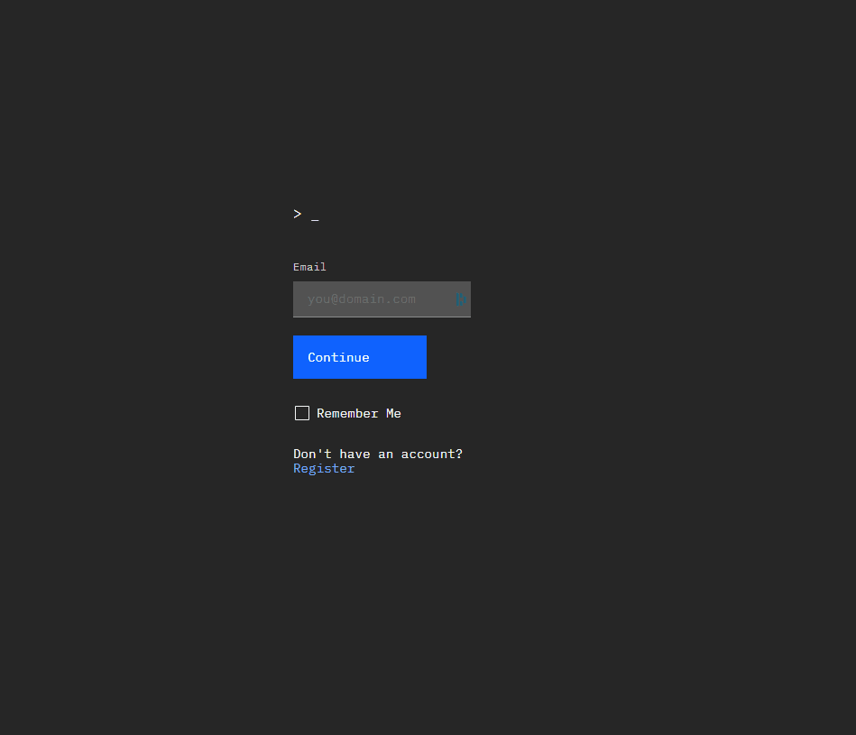
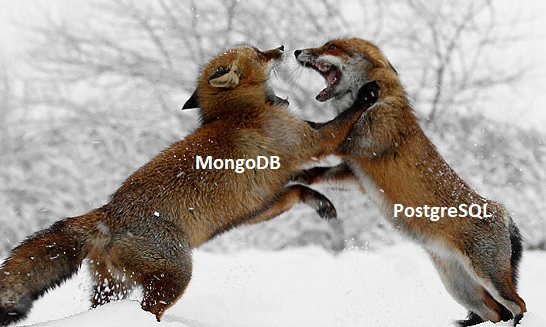

[](https://github.com/chaseoli/backend-code-challenge/actions)

# Test for Dream Job on Quantum Team

Links
* Swagger/OAS3 Docs - [https://app.swaggerhub.com/apis-docs/chaseoli/quantum-pokemon/1.0.2](https://app.swaggerhub.com/apis-docs/chaseoli/quantum-pokemon/1.0.2)
* Demo UI - [https://pokemon-dcb38.web.app/](https://pokemon-dcb38.web.app/)
* Tests Status - [https://github.com/chaseoli/backend-code-challenge/actions](https://github.com/chaseoli/backend-code-challenge/actions)



## Getting Started

```bash

# IMPORTANT! Get the "dev.env" file from a team member and paste it into the ./api directory. This file contains development secrets to run the application locally.

# Install project dependencies (one time only)
npm run install-deps

# start up the server and the ui
npm start

# Done! Go to http://localhost:4200

# NOTE: if using vscode you can also use launch.json configs
```

# Architecture

## API Server (Back-end)

The application level architecture for this API utilizes a controller based approach to contain the logic for all endpoints. Javascript decorators in controllers are used by TSOA (the api framework) to generate swagger documentation. The middleware.ts contains all the middleware logic for this application

TODO: Migrate to loopback.io instead of TSOA if there is time

## Database Selection


While the _Pokemon_ data appears to be consistently structured currently (which is good for a SQL pattern), _Pokemons_ have a tendency to evolve and change given the unpredictable nature of super powers. Therefore, I have chosen a document db (ie: Mongo) so that I will have more agility in the long-run when it comes to mutating the data structure as the project matures over time. I will take care to build typed interfaces for my data models so as to thwart against data inconsistencies at scale. In general, when implemented properly, it has been my experience the a document DB can be used to more easily achieve performance at scale if the data structure is normalized and flattened as much as possible. Furthermore, using MongoDB Atlas, I can get up and running quickly with a highly available DB cluster and not have to worry about about db hosting, for free!

### Mutating state with **_Favorites_** field
The challenge in data modeling is balancing performance with the needs of the application. The more efficient your data retrieval pattern the better your performance at scale. We could choose to simply add a favorites _boolean_ field to each Pokemon object and we would be done. However, there are some problems with this approach see detailed discussion at [https://github.com/chaseoli/backend-code-challenge/blob/d6c4b0d612fd9041d01de1c466770c79d6b88bda/api/src/models/pokemon.type.d.ts#L51](https://github.com/chaseoli/backend-code-challenge/blob/d6c4b0d612fd9041d01de1c466770c79d6b88bda/api/src/models/pokemon.type.d.ts#L51)

NOTE: I decided to take this a step further and add a authentication mechanism to allow logged-in users to track their favorites.

## UI (Front-end)
See a live demo UI at https://pokemon-dcb38.web.app/
NOTE: First time users will need to register for an account with a email and password. The register link is on the home page.

## Deployment
### UI Deployment
The ui is deployed as a single page application like a CDN or using cloud storage.
### API Server Deployment
I contemplated using Kubernetes to deploy this, however a cluster with 3 min nodes is expensive and overkill for the needs of the this project. I decided to take advantage of deploying the node.js server to GCP app-engine which will operate almost entirely for free. Please see `npm run deploy-dev` for more details regarding deployment.  

## Secret Manager
The api should NEVER have the ability to write/update secrets. The API should only consume these configurations via the secret manager. The system admin will be manually provisioning secrets thought cloud UI Console. This project makes use of GCPs secret manager and integrates securely with App-engine.
